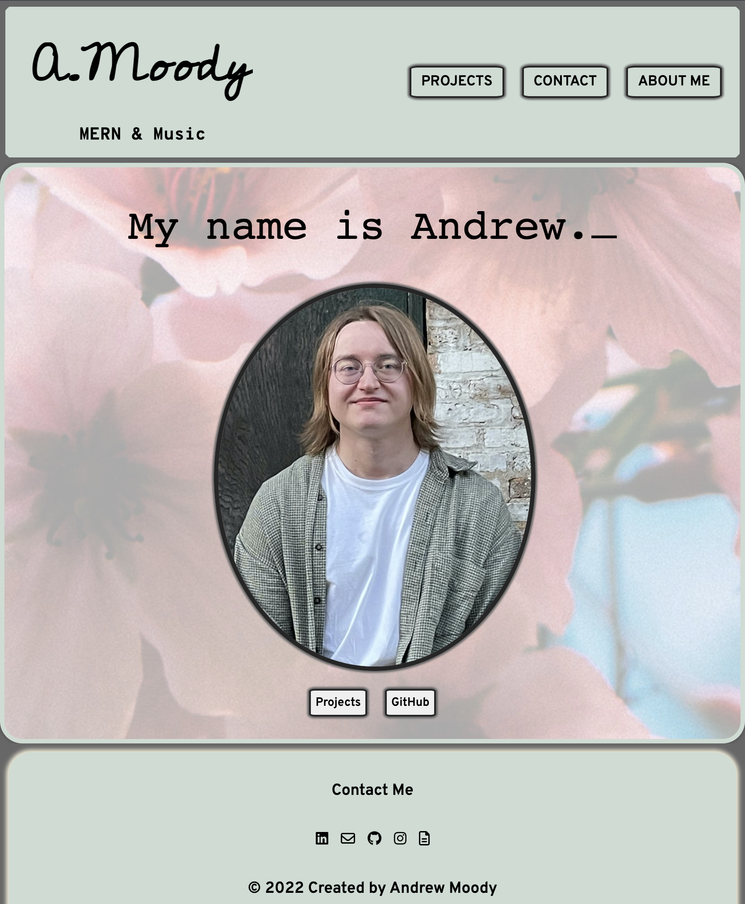
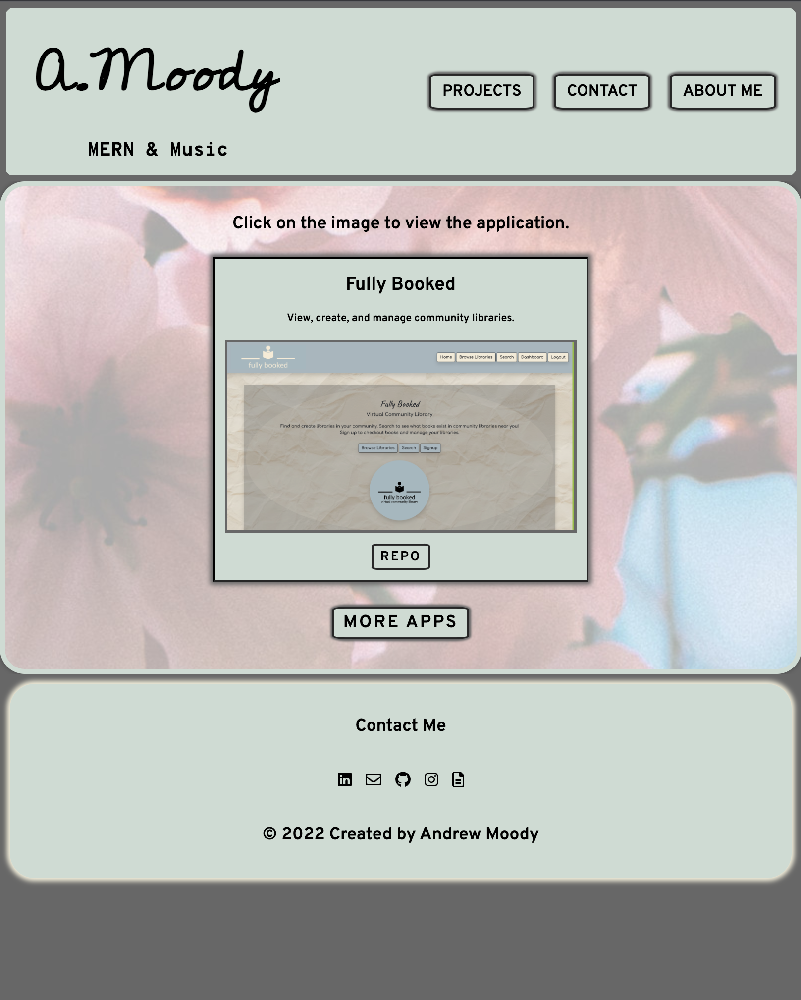
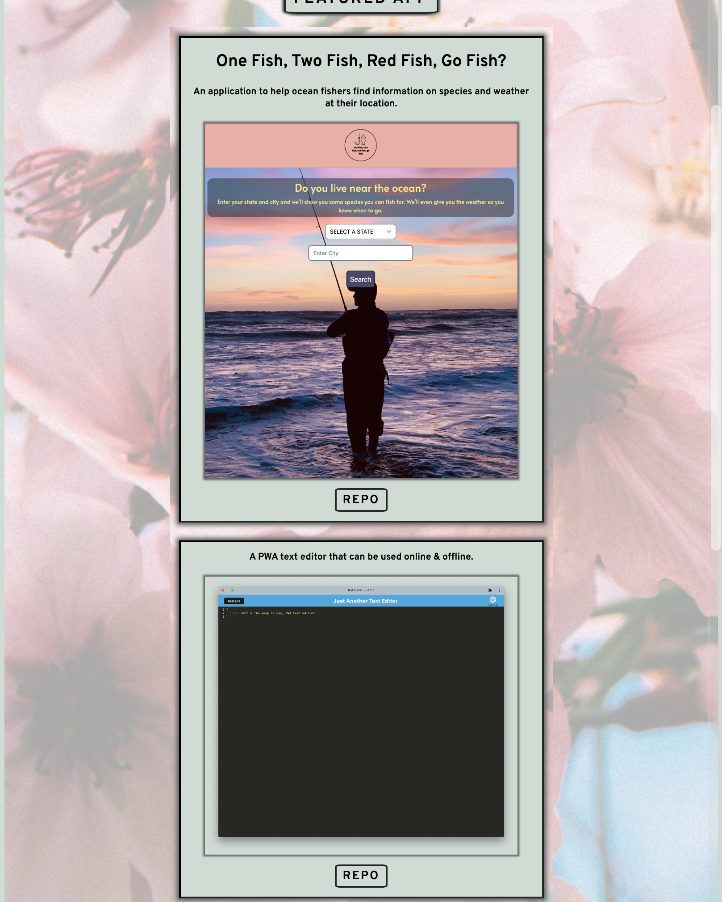

# Moody React Portfolio   
---

## Description

My portfolio, built using React. Click [here](https://andrewmoody96.github.io/portfolio-react/) to view the page.

---
## Table of Contents

- [Photos](#photos)
- [Contributing](#contributing)
- [Questions](#questions)
- [License](#license)

---
## Photos

---
## Contributing

Fork the project please and thanks.

---
## Questions

If you have any questions, please send an email to <andrew.moody96@gmail.com>, or check out my [GitHub](https://github.com/andrewmoody96).

---
### Copyright 2022, Andrew Moody 
  #### License
  
   
  [MIT License](https://opensource.org/licenses/MIT)